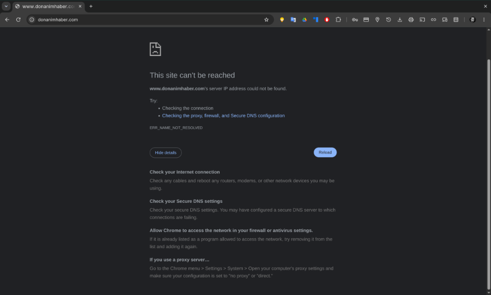

# OmaStudio 📸

**Quickshell & Rust-Powered Professional RAW Photo Studio for Omarchy Linux**

*Lightroom-grade parametric non-destructive RAW editing, Hollywood-standard DaVinci 3-Way color wheels, AI-powered social media optimization, dual storage (Local + Google Drive), and modern open-source multi-format export engine.*

[English](README.md) • [Türkçe](README.tr.md)

[](LICENSE)
[](https://omarchy.org)
[](Cargo.toml)
[](qml/)
[](AGENTS.md)
[](https://buymeacoffee.com/ozdil)



---

## 🏛️ Architecture & Principles

OmaStudio employs a high-performance hybrid architecture designed specifically for the modern Linux desktop: The graphical user interface runs at 60+ FPS powered by GPU-accelerated **Quickshell (Qt 6 / QML)**, while the image processing and RAW decoding pipeline is driven by a multi-threaded **Rust (Rayon + LibRaw FFI)** engine.


---

## 🔄 RAW Processing Pipeline

Every RAW pixel undergoes lossless, mathematically precise transformations to preserve maximum dynamic range:

```mermaid
flowchart LR
    A["📸 RAW Input<br/>(Bayer / X-Trans)"] --> B["⚡ LibRaw<br/>Demosaicing"]
    B --> C["🌡️ White Balance<br/>(Kelvin & Tint)"]
    C --> D["☀️ Exposure<br/>(EV Logarithmic)"]
    D --> E["🎛️ Light & Dynamic Range<br/>(Whites/Blacks/Highlights/Shadows)"]
    E --> F["🎨 8-Band HSL<br/>Color Mixer"]
    F --> G["🎡 DaVinci 3-Way<br/>Color Wheels"]
    G --> H["🔍 Detail & Optics<br/>(Sharpening / Denoise / Defringe)"]
    H --> I["🌈 ICC Profile Output<br/>(sRGB / AdobeRGB / P3)"]
    I --> J["💾 Multi-Format Export<br/>(JPEG XL / AVIF / WebP / TIFF / JPEG)"]
```



---

## 🌟 Key Features

### 1. Comprehensive RAW Format Support
* **Nikon:** `.NEF`, `.NRW` (including Z8 / Z9 High-Efficiency HE/HE*)
* **Fujifilm:** `.RAF` (X-Trans II/III/IV/V 6x6 matrix sensors & Bayer)
* **Canon:** `.CR2`, `.CR3` (ISOBMFF-based)
* **Sony:** `.ARW`, `.SR2` (Alpha 7/9/1 series)
* **Leica & Universal DNG:** `.DNG`, `.RWL` (M, SL, Q series, drones, and smartphones)
* **Others:** Olympus (`.ORF`), Panasonic (`.RW2`), Hasselblad (`.3FR`)

### 2. 1:1 macOS Touchpad & Mouse Ergonomics
Linux desktops have historically suffered from jittery or uncontrolled touch gestures. OmaStudio resolves this completely by matching **Apple Magic Trackpad and macOS canvas ergonomics 1:1**:
* **Two-Finger Pinch-to-Zoom:** Smooth, continuous, logarithmic zoom anchored directly to the cursor or pinch focal point without jumps.
* **Smart Rotation & 3.5° Deadzone:** Intelligent deadzone filtering prevents accidental rotation while pinching to zoom, with 360° free canvas rotation when intentional.
* **Two-Finger Kinetic Pan:** Effortless, frictionless gliding across zoomed images with damped kinetic friction (`0.75`).
* **Double-Tap / Double-Click Toggle:** Instantly toggle between 100% Fit-to-Screen and 200% 1:1 pixel inspection with angle reset.
* **Precise Mouse vs. Touchpad Discrimination (`WheelHandler`):** Mouse wheels zoom smoothly around cursor position; trackpads pan smoothly with two fingers; `Alt + Wheel` provides micro-angle corrections with 1.5° precision.
* **Boundary Clamping (`clampPan`):** Smart edge anchors prevent the image from flying off-screen during rapid navigation.

### 3. Modular Independent Reset & Dual UI Modes
* **Simple Mode (Rapid Workflow):** One-click AI Auto-Enhance and 4 fundamental sliders (Exposure, Temperature, Vibrance, Contrast).
* **Pro Studio Mode:** Dedicated **RESET** button on every module header:
  * **White Balance:** Reset 2,000K – 12,000K Kelvin and Green/Magenta Tint.
  * **Light & Dynamic Range:** Reset Exposure, Contrast, Highlights, Shadows, Whites, and Blacks independently.
  * **Presence & Texture:** Reset Texture, Clarity, Dehaze, Vibrance, and Saturation.
  * **Color Mixer (8-Band HSL):** One-click batch reset for Red, Orange, Yellow, Green, Aqua, Blue, Purple, and Magenta channels.
  * **Detail & Optics:** Reset Sharpening, Noise Reduction (NR), Vignette, Defringe, and Lens Distortion.
  * **DaVinci 3-Way Wheels:** Neutralize Lift, Gamma, Gain, and Offset wheels with a single click.

### 4. AI-Powered Social Media Optimizer
Platform-tailored resolution, aspect ratios, and micro-contrast presets engineered to counter aggressive compression algorithms:

| Platform | Aspect Ratio | Resolution | Profile Target |
| :--- | :---: | :---: | :--- |
| **Instagram Feed** | `4:5` | 1080 × 1350 | Vertical maximum screen real estate, anti-compression edge sharpness |
| **Reels / Stories / TikTok** | `9:16` | 1080 × 1920 | Full-screen mobile vertical framing, OLED vibrance boost |
| **X (Twitter)** | `16:9` | 1200 × 675 | Desktop & mobile feed optimization with crisp micro-contrast |
| **Square Portrait** | `1:1` | 1080 × 1080 | Classic grid balance and profile portfolio display |
| **Facebook HD** | `1.91:1`| 2048 × 1072 | High-resolution album and page publishing |
| **YouTube Thumbnail** | `16:9` | 1280 × 720 | High click-through rate (CTR) vivid color saturation |

---

## ⚡ Feature Comparison

| Feature | OmaStudio | Adobe Lightroom | Darktable | RawTherapee |
| :--- | :---: | :---: | :---: | :---: |
| **License & Freedom** | **Open Source (MIT)** | Proprietary / Monthly Subscription | GPLv3 | GPLv3 |
| **Native Integration** | **Omarchy & Quickshell** | macOS / Windows Only | GTK | GTK |
| **DaVinci 3-Way Wheels**| **Native & Real-Time** | Classic Color Grading | Complex Modules | RGB Curves |
| **JPEG XL / AVIF Export** | **Hardware Accelerated** | Limited | Via Plugins | Partial |
| **Social Media AI Presets**| **One-Click Automated** | Manual | Manual | Manual |
| **Cloud Integration** | **Google Drive (Rclone FFI)**| Adobe Cloud (Enforced) | None | None |
| **Resource Footprint** | **Lightweight (~35 MB RAM)** | Heavy (2+ GB RAM) | Moderate (~400 MB) | Moderate (~350 MB) |

---

## 🚀 Installation & Usage

### System Requirements & Dependencies
* `libraw` (RAW image decoding engine)
* `quickshell` (Qt 6 QML desktop shell runtime)
* `rclone` (Google Drive and cloud storage synchronization)
* `libjxl` & `libavif` (Modern hardware-accelerated image codecs)
* `zenity` (Native file selection dialogs)
* `rust` (Toolchain for compiling the native engine)

### Build & Local Installation
```bash
# Clone and build the project
cargo build --release --locked

# Install the binary locally
install -d -m 755 ~/.local/bin
install -m 755 target/release/omastudio-engine ~/.local/bin/

# Launch OmaStudio
omastudio
```

---

## ⌨️ Keyboard Shortcuts & Workflow

* `Ctrl + O`: Open RAW image dialog
* `Ctrl + S`: Quick export
* `C`: Toggle Crop & Composition mode (Rule of Thirds, Golden Ratio, Fibonacci)
* `Y`: Toggle Split Before / After (A|B) view
* `Ctrl + Shift + C`: Copy color & tone recipe to clipboard
* `Ctrl + Shift + V`: Paste recipe onto selected image
* `Ctrl + R`: Reset all adjustments to defaults
* `Double Click`: Toggle between 100% Fit and 200% Pixel Inspection

---

## 🔒 Security Standards (`AGENTS.md`)

OmaStudio strictly conforms to the Omarchy Linux Security Standards:
1. **Isolated Process Groups (`cmd.process_group(0)`):** Subprocesses run in dedicated PGIDs; on timeout, RAII `ProcessGroupGuard` ensures clean cleanup with SIGTERM and SIGKILL, leaving zero zombies.
2. **Protected File Permissions (`0600` / `0700`):** Catalogs and configuration are written atomically (`.tmp_...` + `fs::rename`) with mode `0600`; symlink traversals are rejected.
3. **Quickshell Hardening:** Dynamic strings are rendered with `textFormat: Text.PlainText`; dynamic `eval()` and `createQmlObject()` are strictly prohibited.
4. **Argument Injection Defense:** System utilities are invoked with discrete argument vectors and the `--` delimiter to block flag injection.

---

## ☕ Support & Sponsorship

If you find OmaStudio valuable and want to fuel independent Linux software development:

<a href="https://buymeacoffee.com/ozdil" target="_blank"></a>

---

## 📄 License
MIT License © 2026 Ozan Özdil
