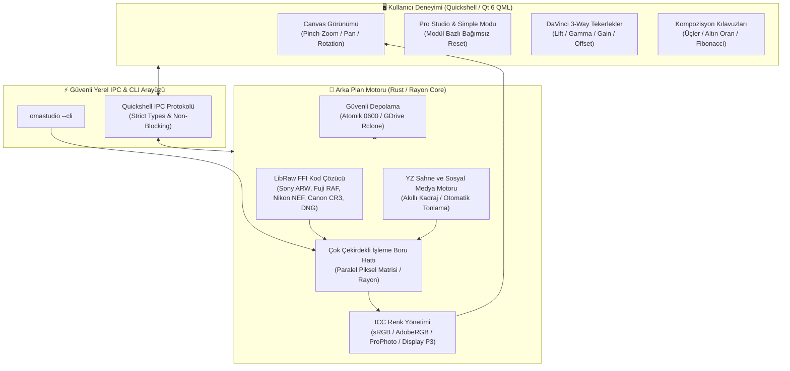

# OmaStudio 📸

**Omarchy Linux için Quickshell & Rust Tabanlı Profesyonel RAW Fotoğraf Editörü**

*Lightroom RAW kalitesinde parametrik düzenleme, Hollywood standardı DaVinci 3-Way renk tekerlekleri, yapay zeka destekli akıllı sosyal medya optimizasyonu, çift depolama (Yerel + Google Drive) ve yeni nesil açık kaynak dışa aktarma motoru.*

[](LICENSE)
[](https://omarchy.org)
[](Cargo.toml)
[](qml/)
[](AGENTS.md)


---

## 🏛️ Mimari ve Çalışma Prensibi

OmaStudio, modern Linux masaüstünde yüksek performanslı fotoğraf düzenleme için hibrit bir mimari kullanır: Kullanıcı arayüzü GPU ivmeli **Quickshell (Qt 6 / QML)** üzerinde 60+ FPS ile çalışırken, görüntü işleme ve RAW kod çözme boru hattı çok çekirdekli **Rust (Rayon + LibRaw FFI)** motoru tarafından yürütülür.



---

## 🔄 Görüntü İşleme Boru Hattı (RAW Processing Pipeline)

Her RAW pikseli, matematiksel doğruluk ve kayıpsız dinamik aralık korunarak aşağıdaki adımlardan geçer:

```mermaid
flowchart LR
    A["📸 RAW Girdi<br/>(Bayer / X-Trans)"] --> B["⚡ LibRaw<br/>Demosaicing"]
    B --> C["🌡️ Beyaz Ayarı<br/>(Kelvin & Tint)"]
    C --> D["☀️ Pozlama<br/>(EV Logaritmik)"]
    D --> E["🎛️ Işık & Dinamik Aralık<br/>(Whites/Blacks/Highlights/Shadows)"]
    E --> F["🎨 8-Band HSL<br/>Renk Mikseri"]
    F --> G["🎡 DaVinci 3-Way<br/>Renk Tekerlekleri"]
    G --> H["🔍 Detay & Optik<br/>(Keskinlik / Denoise / Defringe)"]
    H --> I["🌈 ICC Profil Çıktısı<br/>(sRGB / AdobeRGB / P3)"]
    I --> J["💾 Çoklu Dışa Aktarma<br/>(JPEG XL / AVIF / WebP / TIFF / JPEG)"]
```



---

## 🌟 Öne Çıkan Özellikler

### 1. Kapsamlı RAW Format Desteği
* **Nikon:** `.NEF`, `.NRW` (Z8 / Z9 High-Efficiency HE/HE* dahil)
* **Fujifilm:** `.RAF` (X-Trans II/III/IV/V 6x6 matris sensörleri ve Bayer)
* **Canon:** `.CR2`, `.CR3` (ISOBMFF tabanlı)
* **Sony:** `.ARW`, `.SR2` (Alpha 7/9/1 serisi)
* **Leica & Evrensel DNG:** `.DNG`, `.RWL` (M, SL, Q serileri, drone ve akıllı telefonlar)
* **Diğer:** Olympus (`.ORF`), Panasonic (`.RW2`), Hasselblad (`.3FR`)

### 2. Akıcı ve Hassas Dokunmatik & Fare Etkileşimi
* **Pinch-to-Zoom:** İmleç veya parmak merkezine logaritmik, sıçramasız yakınlaştırma.
* **Akıllı Rotasyon:** Yakınlaştırma sırasında kazara dönmeyi engelleyen **3.5° ölü bölge (deadzone)** korumalı iki parmakla döndürme.
* **Bağımsız Hız Kontrolü:** Fare tekerleğiyle odaklı yakınlaştırma, iki parmakla yumuşak kaydırma (`pan`) ve `Alt + Wheel` ile 1.5° hassasiyetle mikro açılama.
* **Görünüm Sınırlandırması (`clampPan`):** Resmin ekrandan uçup kaybolmasını engelleyen dinamik çerçeve sınırları.

### 3. Modül Bazlı Bağımsız "Reset" & Çift Seviyeli Arayüz
* **Basit Mod (Hızlı İş Akışı):** Tek tıkla YZ Otomatik İyileştirme ve 4 temel sürgü (Pozlama, Sıcaklık, Canlılık, Kontrast).
* **Pro Studio Modu:** Her modül başlığında bağımsız **RESET** butonu:
  * **White Balance:** 2,000K – 12,000K Kelvin ve Yeşil/Macenta Tint sıfırlama.
  * **Light & Dynamic Range:** Pozlama, Kontrast, Highlights, Shadows, Whites ve Blacks sıfırlama.
  * **Presence & Texture:** Doku, Netlik (Clarity), Sis Giderme (Dehaze), Canlılık (Vibrance), Satürasyon sıfırlama.
  * **Color Mixer (8-Band HSL):** Kırmızı, Turuncu, Sarı, Yeşil, Akuamarin, Mavi, Mor, Macenta kanallarının tek tıkla toplu sıfırlanması.
  * **Detail & Optics:** Keskinlik, Kumlanma Temizleme (NR), Vinyet, Defringe (renk saçaklanması giderme) ve Lens Distorsiyonu sıfırlama.
  * **DaVinci 3-Way Wheels:** Lift, Gamma, Gain, Offset tekerleklerini tek tıkla nötrleme.

### 4. Yapay Zeka Destekli Sosyal Medya Optimizatörü
Platforma özel çözünürlük, en boy oranı ve algoritma sıkıştırma kayıplarını telafi eden mikro-kontrast ön ayarları:

| Platform | En-Boy | Çözünürlük | Profil Hedefi |
| :--- | :---: | :---: | :--- |
| **Instagram Feed** | `4:5` | 1080 × 1350 | Dikey maksimum alan, kompresyon önleyici kenar keskinliği |
| **Reels / Stories / TikTok** | `9:16` | 1080 × 1920 | Tam ekran dikey kadraj, mobil OLED canlılık artırma |
| **X (Twitter)** | `16:9` | 1200 × 675 | Masaüstü/mobil akış optimizasyonu, net mikrokontrast |
| **Kare Portre** | `1:1` | 1080 × 1080 | Klasik ızgara uyumu ve profil sergisi |
| **Facebook HD** | `1.91:1`| 2048 × 1072 | Yüksek çözünürlüklü albüm ve sayfa paylaşımı |
| **YouTube Thumbnail** | `16:9` | 1280 × 720 | Yüksek tıklama oranı (CTR) için canlı renk doygunluğu |

---

## ⚡ Karşılaştırma Matrisi

| Özellik | OmaStudio | Adobe Lightroom | Darktable | RawTherapee |
| :--- | :---: | :---: | :---: | :---: |
| **Lisans & Özgürlük** | **Açık Kaynak (MIT)** | Tescilli / Aylık Abonelik | GPLv3 | GPLv3 |
| **Yerel Entegrasyon** | **Omarchy & Quickshell** | Yalnızca macOS/Windows | GTK | GTK |
| **DaVinci 3-Way Tekerlekler**| **Yerleşik & Canlı** | Renk Derecelendirme (Klasik) | Karmaşık Modüller | RGB Eğrileri |
| **JPEG XL / AVIF Çıktısı** | **Donanım İvmeli** | Kısıtlı | Eklenti ile | Kısmi |
| **Sosyal Medya YZ Şablonları**| **Tek Tıkla Otomatik** | Manuel | Manuel | Manuel |
| **Bulut Entegrasyonu** | **Google Drive (Rclone FFI)**| Adobe Cloud (Zorunlu) | Yok | Yok |
| **Kaynak Tüketimi** | **Hafif (~35 MB RAM)** | Ağır (2+ GB RAM) | Orta (~400 MB) | Orta (~350 MB) |

---

## 🚀 Kurulum & Çalıştırma

### Bağımlılıklar (Arch / Omarchy Linux)
```bash
sudo pacman -S libraw quickshell rclone libjxl libavif zenity rust
```

### Derleme & Yerel Kurulum
```bash
# Projeyi klonlayın ve derleyin
cargo build --release --locked

# İkili dosyayı yerel yola kurun
install -d -m 755 ~/.local/bin
install -m 755 target/release/omastudio-engine ~/.local/bin/

# Uygulamayı başlatın
omastudio
```

---

## ⌨️ Klavye ve İş Akışı Kısayolları

* `Ctrl + O`: RAW fotoğraf açma diyaloğu
* `Ctrl + S`: Hızlı dışa aktarma (Export)
* `C`: Kırpma ve Kompozisyon Modu (Üçler, Altın Oran, Fibonacci)
* `Y`: Öncesi / Sonrası (Split A|B) görünümü
* `Ctrl + Shift + C`: Tüm renk ve tonlama tarifini panoya kopyalama
* `Ctrl + Shift + V`: Kopyalanan tarifi seçili fotoğrafa uygulama
* `Ctrl + R`: Tüm ayarlamaları fabrika çıkışına sıfırlama
* `Double Click`: %100 Fit ve %200 Piksel Görünümü arasında geçiş

---

## 🔒 Güvenlik Standartları (`AGENTS.md`)

OmaStudio, Omarchy Linux resmi güvenlik kılavuzuna koşulsuz olarak uyar:
1. **İzole Süreç Grupları (`cmd.process_group(0)`):** Harici yardımcı araçlar bağımsız PGID ile çalıştırılır; zaman aşımında RAII `ProcessGroupGuard` ile zombi süreç bırakılmadan SIGTERM ve SIGKILL ile temizlenir.
2. **Korumalı Dosya İzinleri (`0600` / `0700`):** Fotoğraf katalogları ve ayarlar `0600` izniyle atomik olarak yazılır (`.tmp_...` + `fs::rename`); symlink saldırıları sıkıca reddedilir.
3. **Quickshell Güvenliği:** Dinamik veriler `textFormat: Text.PlainText` ile gösterilir; dinamik `eval()` veya `createQmlObject()` bulunmaz.
4. **Argüman Enjeksiyonu Koruması:** Sistem komutları asla kabuk dizesi ile çalıştırılmaz, ayrık bağımsız argüman dilimleri ve `--` sınırlayıcısı kullanılır.

---

## 📄 Lisans
MIT License © 2026 Ozan Özdil
